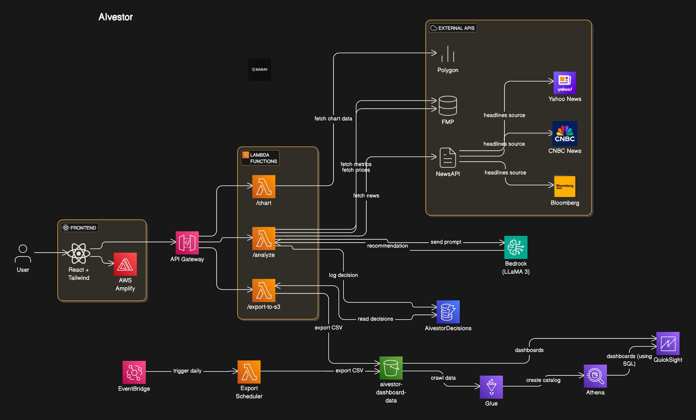

# 🧠 AIvestor — AI + INVESTOR

AIvestor is a full-stack AI-powered stock advisory tool that helps investors make informed buy/sell/hold decisions based on news, financial metrics, and custom LLM reasoning.

---

## 🔍 What It Does

- Takes a stock ticker and optionally your purchase quantity and date
- Fetches real-time financials (cash, debt, earnings) and news headlines
- Builds a prompt and sends it to **Meta LLaMA 3 (via Amazon Bedrock)**
- Returns a personalized recommendation like `BUY MORE`, `SELL`, `HOLD`
- Logs all activity to DynamoDB and exports to S3 for QuickSight dashboards

---

## 🖥️ Frontend (React + Vite + Tailwind)

- Live chart powered by `react-plotly.js`
- Dynamic gradient background based on AI's decision
- Decision badge with color-coded indicator
- Form auto-handles bought vs not-yet-bought scenarios

> 📦 Frontend deployed via AWS Amplify with GitHub CI/CD

---

## 🧠 Backend (AWS Lambda + Bedrock + APIs)

🔒 **Backend is private for security.**  
For access to the LLM prompt templates, Lambda code, and AWS architecture:

📩 Contact: [manav@ieee.org](mailto:manav@ieee.org)

---

## 📊 Visualization Flow

- DynamoDB holds all decisions
- Exported to S3 via scheduled Lambda as CSV
- Visualized live via **Amazon QuickSight**

---
(./red.png)(./buy.png)(./hold.png)(./ui.png)
## 🗂️ Architecture Diagram

---

## 🔧 Tech Stack

- **Frontend**: React, Tailwind CSS, Plotly.js, Vite
- **Backend**: AWS Lambda, Amazon API Gateway, Amazon Bedrock (LLaMA 3), DynamoDB
- **Data Sources**: Financial Modeling Prep, Polygon, NewsAPI
- **Visualization**: AWS S3 + QuickSight

---

## 💬 Support
For backend or AWS help, reach out to **manav@ieee.org**.

> Thank you for exploring AIvestor — where finance meets AI decision-making.
